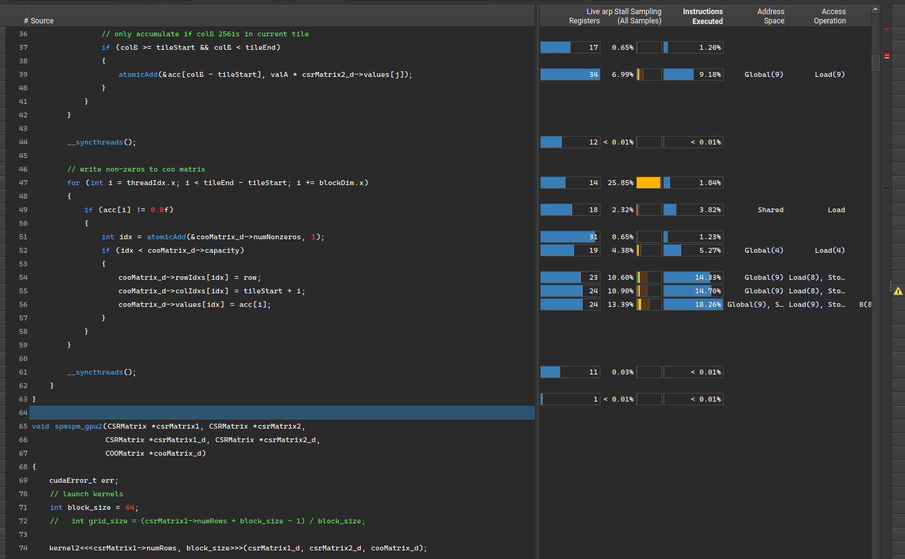
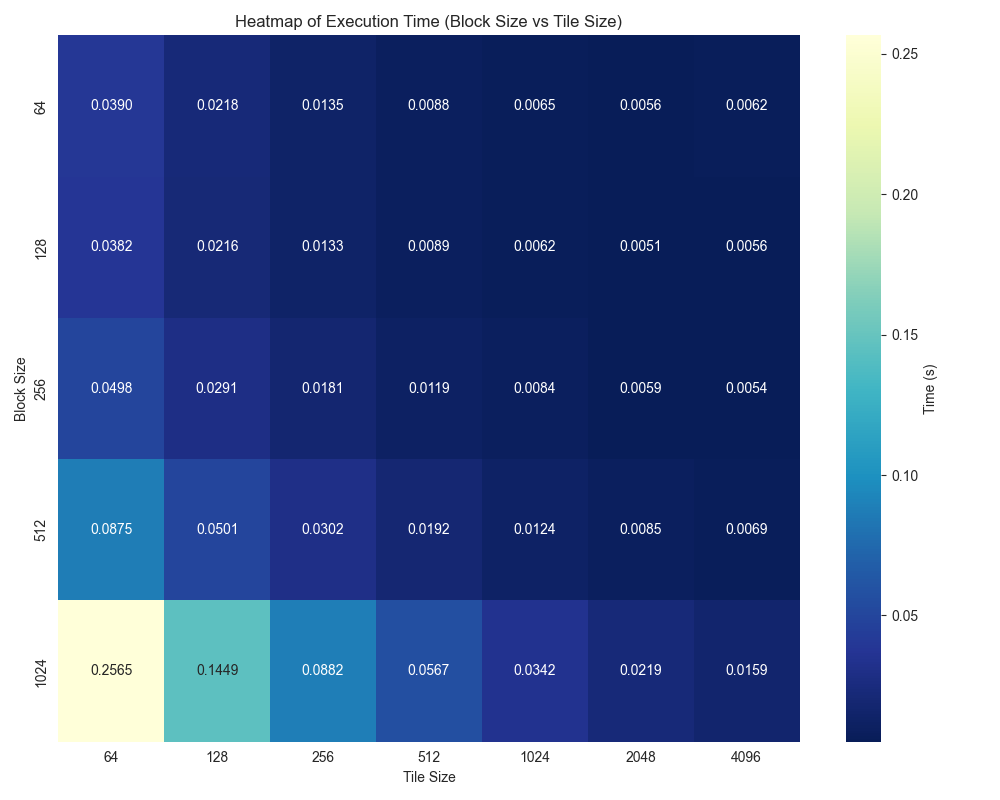
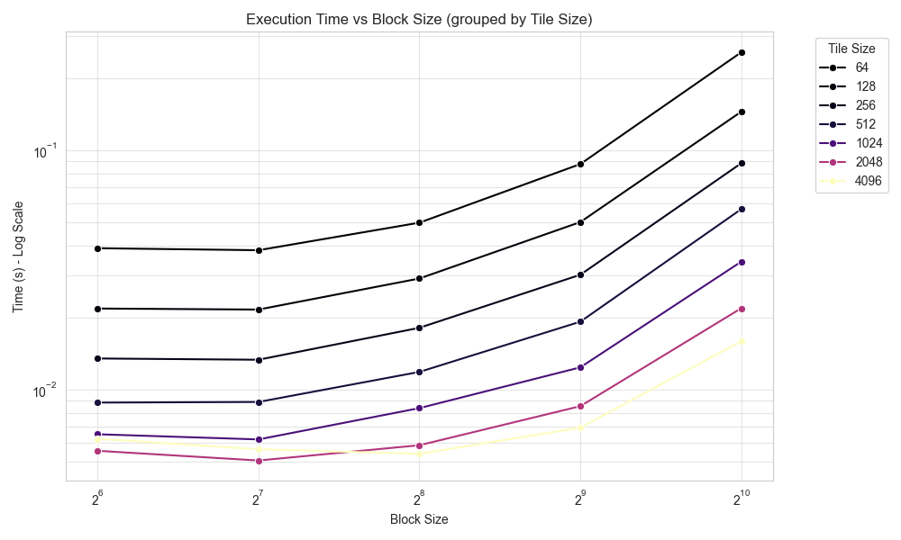
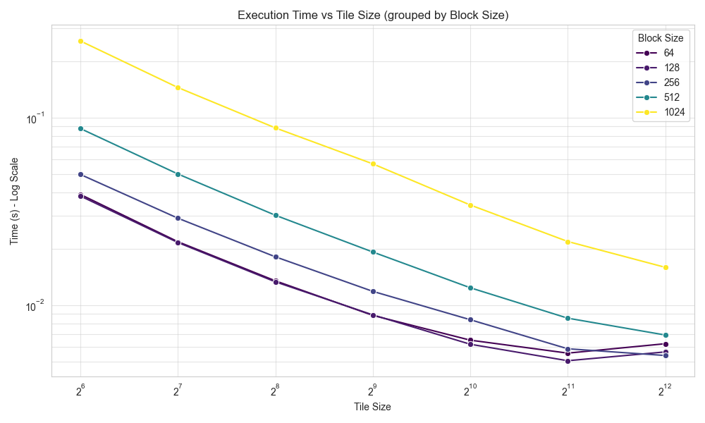

# Introduction to Parallel Computing Final Project

By: William Kaiser and Nicholas Hoffs

## Execution Results

Testing occurred on `gpusrv10` as part of uva cs research computing which has a Quadro RTX 4000 and a Intel(R) Xeon(R) Gold 6230 CPU. On this system, the following execution times were achieved.

- CPU time: 96.190996 ms
- Version 0: 49.316999 ms (-48.7 %)
- Version 1: 44.824000 ms (-9.11 %)
- Version 2: 16.000001 ms (-64.3 %)
- Version 3: 14.950000 ms (-6.56 %)
- Version 4: 13.881000 ms (-7.15 %)

## Kernel Performance

In this section, the incremental performance optimizations made will be described. After the base implementation based on the hint in the instructions to create an accumulator in the instructions, nsight compute was used to identify long-running parts of the program and identify fixes.

### Kernel 0 

Kernel 0 provides the base implementation for sparse matrix-matrix multiplication. For a multiplication of matrices `A` and `B` into output `C`, traditional matrix multiplication kernels (not sparse) multiply row `i` of `A` by a column `j` of `B` to get `C[i,j]`. 

Due to the CSR representation of `A` and `B`, however, accessing columns of `B` is inefficient because it would require searching for particular column indices. A better implementation leverages the structure of the CSR, which makes traversing rows inexpensive. Firstly, we assign each row of `A` a thread. This thread will update all and only the corresponding row of `C`. The kernel avoids searching for column indices of `B` by performing partial sums. For a row `i` in output matrix `C`, a non-zero element `A[i,j]` will contribute to `C[i,k]` for every non-zero `B[j,k]` in row `j` of `B`. By iterating over row `j` of `B` (efficient in CSR), the kernel accumulates these contributions into the appropriate output columns without ever needing to search for specific column indices.

There is an issue, however, with naively writing the partial sum to the output matrix. Since we will be writing to this position multiple times for different rows of `B`, how can we tell if anything has already been written to that particular position in the COO output? Do we create a new entry or not? Checking a value at a particular position is extremely expensive with COO (requires search), so we address this by writing partial sums to an accumulator. Only once this accumulator is filled with all partial sums do we write to the COO matrix. Since no other threads will write to the same location (because each thread is a row), we avoid the checking problem across threads.

This introduces another issue: we don't have enough memory to store all the partial sums. Therefore, we take a tiled approach. The accumulator is only responsible for accumulating results for `TILE_SIZE` columns at a time. After processing all contributions to the current tile, non-zero values are written to the COO output, and the accumulator is reused for the next tile of columns.

### Kernel 1

Kernel 1 makes minor optimizations to ensure proper data loading based on non-overlapping and unchanging areas of memory.

For one, we hoisted certain invariants outside of loops where they don't need to be updated. When iterating over tiles, we will always be using the same row start and end points. Similarly, `csrMatrix2_d->numCols` is constant throughout the entire kernel execution, yet kernel0 accessed it through the struct pointer on every tile iteration. By loading it once into a local variable (`BnumCols`), we avoid repeated pointer dereferencing.

Second, we cache certain struct members that are re-used. Instead of requiring the GPU to first access the struct, then its member, then index, our kernel stores these pointers (e.g. `colIdxs`) into a variable.

Lastly, since we know there isn't memory overlap between pointers like `rowPtrs` and `colIdxs`, we can use the `__restrict__` keyword to cache more aggressively.

All in all, these optimizations resulted in about a 10% speedup. This kernel optimization was about refinement and setting a healthy baseline for future optimizations.

### Kernel 2

Kernel 2 addresses the load imbalance present in Kernels 0 and 1. Previously, threads processing rows with many non-zeros performed significantly more work while threads with sparse rows sat idle. Kernel 2 changes the division of labor from "one thread per row" to "one block per row." All threads in a block process the same row of `A`, distributing the iteration over `A`'s non-zeros using a strided access pattern. This improves memory coalescing since adjacent threads access adjacent values from `A`.

Because multiple threads might contribute to the same output column, we move the accumulator to shared memory and use atomic additions. Synchronization barriers ensure the accumulator is initialized before computation, fully populated before writing output, and cleared before the next tile. Tile size can also be increased from 512 to 2048 because of the smaller memory footprint of only doing a single operation per block. This reduces the number of passes over A's non-zeros.

Kernel 2 approximately halves execution time from 44 ms to 16 ms.

Profiling this kernel in Nsight Compute revealed that the writeback stage to the COO matrix takes 53% of total execution time (5% + 14.3% + 14.7% + 18.3%). This insight motivated kernel 3's modifications to use shared memory to perform the accumulation. Below is a screenshot from Nsight Compute demonstrating the issue:

### Kernel 3

As noted in the Kernel 2 section, the writeback to the COO matrix took up most of the execution time. In Kernel 2, every non-zero element causes an atomic add to global memory, causing significant contention and serialization. Kernel 3 addresses this by batching the global writebacks. First, threads count the non-zero elements using shared memory atomics, then a single thread reserves the entire block's output range with one global atomic (incrementing numNonzeros), and finally threads write to their assigned positions using shared memory atomics. 

The magnitude of impact of this optimization was suprising because avoiding the global memory atomic add to the number of non-zeros per non-zero was only 6% of kernel execution time. However, there was more time-savings when it came to writes made to cooMatrix_d.

The most likely explanation for this fact is how writes to COO are more coalessed because of the faster atomic adds to `tile_write_offset`. This is important because this shows how profilers reporting of time-taken per line can be a misleading metric for cache optimization.

### Kernel 4

Kernel 4 addresses the bottleneck of summing the number of non-zero elements. This kernel creates a thread-local running count of the number of non-zero elements by checking if the previous value from the atomic add was 0.0f. Then, a warp-level primitives were used to aggregate a sum before a single atomic add took place to the block-level sum in shared memory.

Finally, kernel 4 uses templating to run a grid-search to find the optimal parameters for this kernel. Block sizes between 64 and 1024 were tested along with tile sizes between 64 and 4096 were tested. To ensure accurate timing, the first 3 results collected were skipped. This was specifically employed to fix issues where newly compiled kernels would take hundreds of milliseconds initially but return to their normal execution times upon successive re-runs.

## Alternatives Attempted

When attempting to reduce the use of atomics, a prefix sum for non-zero elements was used. Despite avoided atomic operations, using a prefix-sum marginally increased total execution time.

However, because prefix-sum is a constant-time operation the benefit to it's use would increase depending on the sparsity of the input matrix.
